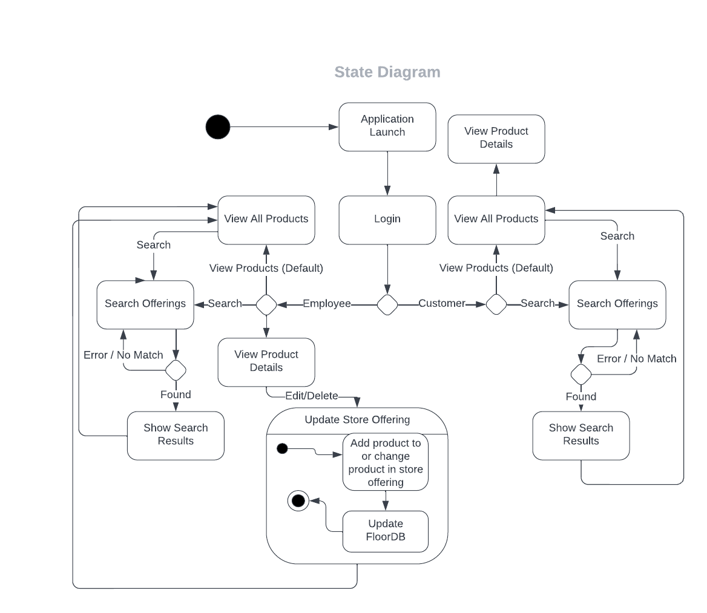

# Design Document

**Author**: \<Tenzin Norsang, Alejandra Reyes, Abdul Wahab\>

## 1 Design Considerations

### 1.1 Assumptions

The software depends on user input and on managing the database to perform CRUD. The major project issue we are facing right now is how we are going to implement our UML design to functional code in a way that meets the requirements. We are also concerned with how we are going to implement the database into our system since we are uncertain about how our data will be stored.

### 1.2 Constraints

The main constraint on the system that has a significant impact on the design of the system is storing data in a hierarchical structure. The requirement asked for data to be stored and retrieved in a specific way. This impacts how we perform CRUD on the database. We have to store the data in key, value pairs in a way that it will be stored in a hierarchical structure. 

### 1.3 System Environment

The software runs on an Android Studio environment; hence, we are targeting the software to run on all Android operating system apps with API level 21 and above. 

## 2 Architectural Design

### 2.1 Component Diagram

The component diagram contains 6 components which encapsulate the functions provided by our application. The floor database is a required component of the Product Offerings component because the product offering component retrieves information about stock from the database. The product offering component provides an interface from which products can be changed or deleted. A user that is also an employee can add to a product offering, which updates the database. The floor component is used to make up the product offerings. The search engine is dependent on the product offerings, and provides both basic and hierarchical search. Together, these components form the core functionality of our application.

### 2.2 Deployment Diagram

The deployment diagram shows how the components will be deployed on a mobile device. The application will be deployed on an Android Device, specifically on the Android 11 Platform which uses API 30. Our application runs on this device. The database used to manage the store offerings is locally stored on the device, and created within the application

## 3 Low-Level Design

### 3.1 Class Diagram

### 3.2 Other Diagrams

*Describe some dynamic aspects of your system using one or more behavioral diagrams, such as sequence and state diagrams.*

The state diagram shows how the system transitions between various states. This state diagram accounts for user login, view, search, and employee add/edit/delete. Update Store Offering is a composite state that exits when both the store offering is changed, and the database is updated. This ensures that the database is synchronized with the store offerings. Search, view and add/edit/delete loop back to view all products. The exit condition is that the user must exit the application. This diagram also accounts for viewing a detailed product description through the view product details class.

## 4 User Interface Design

