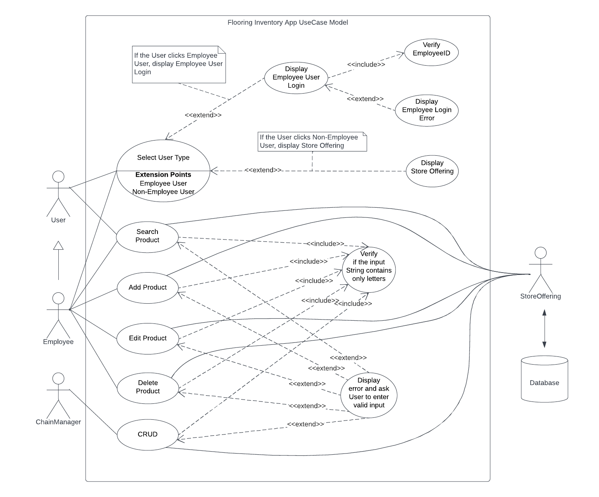
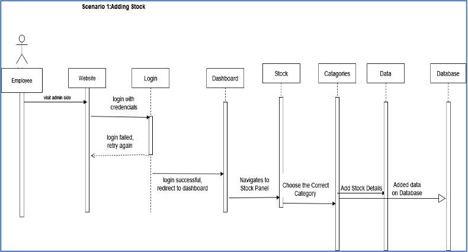
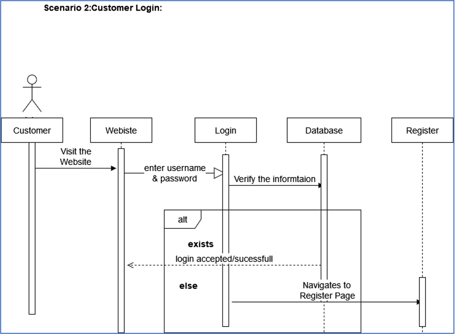
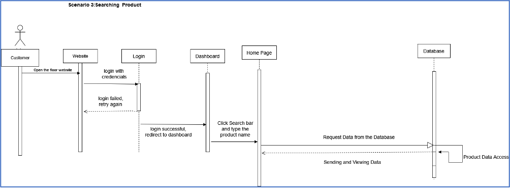

# Use Case Model

- *Author**: \<Marwan Aljawarneh, Fahim Ahmed, Tenzin Norsang\>

## 1 Use Case Diagram

## 2 Use Case Descriptions

The user which is the customer and the employee must log-in in order to use the app. They both have the ability to view and search the items listed, however, only the employee has the access to edit, delete and add products. Chain Manager has ability to add, delete, edit, and search store offerings. Store offering retrieves its data from the database. 

Pre-conditions:

- Employee-Users can log in by entering their employeeID.
- Customer Users can log in by just selecting the Customer User Type.
- If the customer/employee did not log in to the application, they cannot interact with the application.

Post-conditions:

- Once Employee User logs in, they will be directed to a screen that shows store offering products and has buttons: search, add, delete, edit.
- Once Customer User logs in, they will be directed to a screen that shows store offering products and has only one button: search.

Scenarios:

- Adding Stock
    
    
    
- Customer Login
    
    
    
- Search
    
    
    

Exceptions:

- Customer searching for an unavailable item name.
- The employee making a mistake while adding, editing, and deleting may lead to an exception.

Alternatives:

- If a customer searches for an unavailable item name, a list of available items will show instead.
- If the employee makes a mistake while adding, editing, and deleting items an error will pop so he can fix it.