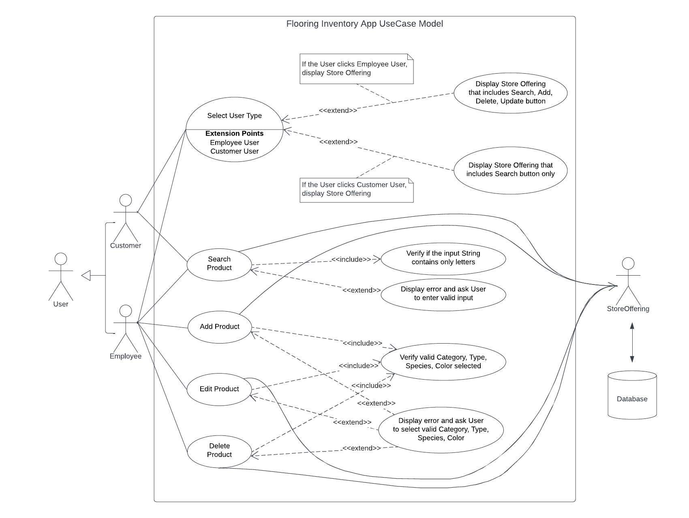

# Use Case Model

- **Author**: \<Marwan Aljawarneh, Fahim Ahmed, Tenzin Norsang\>

## 1 Use Case Diagram

## 2 Use Case Descriptions

Requirements: 

- The user of the app, customer or employee, must be able to search for floor products by picking from a hierarchical list, where the first level is the floor category, the second level is the floor type, and the third level is floor species if the wood floor category is selected. The store employee user must be able to add, edit, and delete floor products to/from the store list that stores these floor products in the database.

Pre-conditions:

- The user of the app must select the appropriate user type in order to display the appropriate corresponding screen.
- In order to search for products, the employee user must add the floor products in a hierarchal list structure, where the first level is the floor category, the second level is floor types, and more levels are based on the selected floor category.

Post-conditions:

- Customer user-type will be directed to a screen that shows the store offering products and has only the search button functionality.
- Employee user-type will be directed to a screen that shows the store offering products and has buttons: search, add, edit, and delete.
- Both the customer and employee user types can search products in a hierarchal list manner.

Scenarios:

- Normal:
    - Customer and Employee user types can search for products in two ways. First, by entering the floor category or type name in a string form. Second, by using the drop-down search button that first lists the floor category, then floor type, and more levels based on the selected floor category.
    - Employee users can add the products by pressing the add button which will direct them to a different screen.
    - Employee users can edit or delete the products by clicking on one of the products from the list of the products.

- Alternatives:
    - If the user searches for an unavailable item name, a list of available items will display instead.
    - If the user searches for an item using a non-letters string or non-string variables, such as numbers or special characters, an error message will be displayed.
    - If the employee user makes a mistake while adding, editing, and deleting items, an error will be displayed.
    
- Exceptions:
    - A customer searching for an unavailable item name or non-string variables.
    - The employee making a mistake while adding, editing, and deleting may lead to an exception.