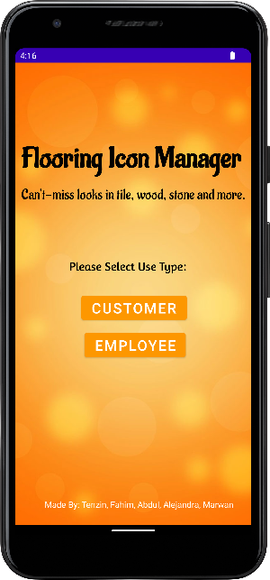

# User Manual

- **Author**: Tenzin Norsang

This application runs on any Android OS phone that has API 21 or above. The app functionality depends on the type of user. The Customer user type can only search products in the database, and the Employee user type can search, add, delete, and edit products in the database. 

## Login

When you open the app, the first screen displayed is the login page that allows the user of the app to select the type of the user: Customer or Employee. 

### Customer Store Offering Screen

If the user selects Customer, the user will be directed to a screen that displays all the products that the store offers and it has a Search button at the top of the screen.

### Employee Store Offering Screen

If the user selects Employee, the user will be directed to a screen that displays all the products that the store offers, it has a Search button at the top of the screen and an Add button (+) at the bottom of the screen. 

## Search Product

After selecting the appropriate user type, the user will be directed to a screen that displays all the products that the store offers. Both the Customer and Employee user types have the ability to search products in the store listing. 

There are two ways to search for a product. First, by entering the floor category or floor type name in a letter string form. Second, by using the drop-down search button that first lists the floor category, then floor type.

### Search Product by typing the name

To search for a product, the user can click on the search symbol located at the top of the screen and the keyboard will pop up for the user to type the product name in letters. 

After entering the product name in letters, if the product name exists, it will display, and if the product name does not exist, it will show an empty screen. 

### Search Product by the drop-down search button

The user can use the drop-down search button by selecting the floor category and floor type. 

When the user clicks on the drop-down search button, the app displays the first level of the hierarchy list which is the floor category. After the user selects the floor category, it displays the second level of the hierarchy list which is the floor type. Once the user clicks SUBMIT button, it searches for that product. 

## Add Product

Only the Employee user has the ability to add products to the app. 

If the Employee user selects the Add button (+), the user will be directed to a screen that inquires the user to make a selection in a hierarchal list - where the first level is the floor category, the second level is the floor type, and the third level is floor species if the wood floor category is selected. Once the user selects all the necessary attributes for the product to be added and presses the Add button, this information will be added to the database. 

## Edit and Delete Product

Only the Employee user has the ability to edit and delete products from the app. 

If the Employee user selects one of the products from the list, the user will be directed to a screen that displays more details about the selected product and it also displays Edit and Delete button at the bottom of the screen. 

### Edit/Update Product

When the user clicks on the Edit button at the bottom of the screen, the user will be directed to a different screen. On this screen, the user can edit the product’s attributes by clicking on the drop-down button to select different floor category, floor type, floor species, color, quantity, price, and brand. 

Once the user has made changes, they can click the Update button, which will update the database and the app, and will be redirected to the store offering screen that displays all the products and the new updated product information.  

### Delete Product

When the user clicks on the Delete button at the bottom of the screen, it will show a pop-up message that asks if the user is certain about deleting the product. If the user clicks the “Yes” button, it will delete the product from the app and the database, and then the user will be directed to the store offering screen that displays all the products without the deleted product. 

